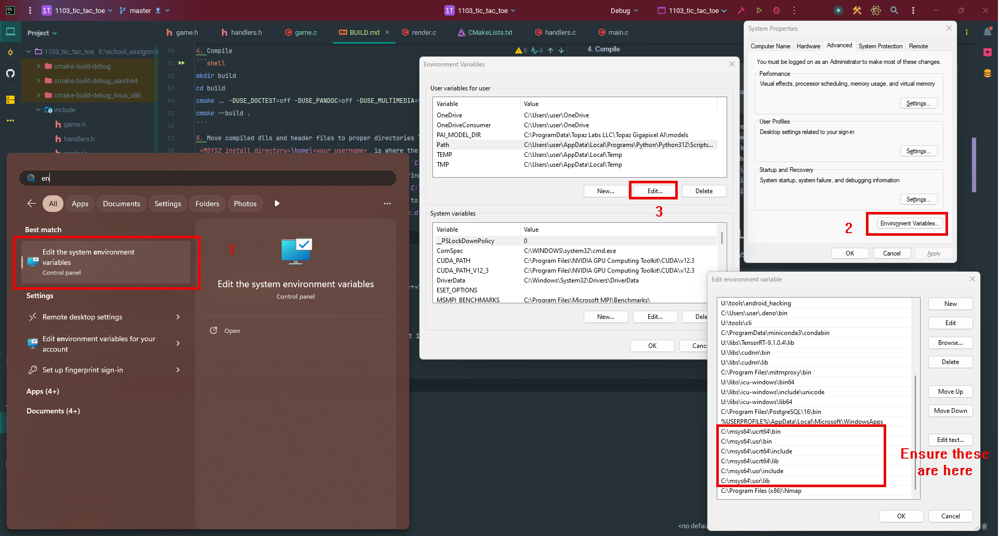

# Build steps

## Requirements

- Cmake version 3.13+
- libnotcurses version 3+
- gcc version 13+
- WSL with Ubuntu 22.04+
- MSYS2 version 3.5.4+

## WSL installation
More information can be found here \
https://learn.microsoft.com/en-us/windows/wsl/install \
https://documentation.ubuntu.com/wsl/en/latest/guides/install-ubuntu-wsl2/ \
It is recommended to update Ubuntu to the latest LTS release 

## Compiling for Windows
### Compile libnotcurses
1. Open MSYS2 UCRT64 shell and run the following commands inside it
2. Install the necessary packages
```shell
pacman -S mingw-w64-ucrt-x86_64-cmake mingw-w64-ucrt-x86_64-libdeflate mingw-w64-ucrt-x86_64-libunistring mingw-w64-ucrt-x86_64-ncurses mingw-w64-ucrt-x86_64-ninja mingw-w64-ucrt-x86_64-openimageio mingw-w64-ucrt-x86_64-toolchain mingw-w64-ucrt-x86_64-ffmpeg
```
3. Clone the repo
```shell
git clone https://github.com/dankamongmen/notcurses.git
cd notcurses/
```

4. Compile
```shell
mkdir build
cd build
cmake .. -DUSE_DOCTEST=off -DUSE_PANDOC=off -DUSE_MULTIMEDIA=ffmpeg -DCMAKE_BUILD_TYPE=Release
cmake --build .
```
5. Move compiled dlls and header files to proper directories \
`<MSYS2 install directory>\home\<your username>` is where the cloned git repo is at \
Assuming your username is `user` and MSYS2 is installed on `C:\msys64` \
`C:\msys64\home\user\notcurses\include` is where you will find notcurses header files \
Copy `C:\msys64\home\user\notcurses\include\notcurses` to `C:\msys64\ucrt64\include` \
Copy `C:\msys64\home\user\notcurses\build\libnotcurses.dll`to `C:\msys64\ucrt64\lib` \
Copy `C:\msys64\home\user\notcurses\build\libnotcurses-core.dll`to `C:\msys64\ucrt64\lib` 
6. Ensure include and lib directory is in your PATH

7. Build, run commands in powershell
```pwsh
mkdir build
cd build
cmake ..
cmake --build ./
```

## Compiling for Linux on WSL
1. Install libnotcurses-dev and build tools on your WSL install if you haven't already
```shell
sudo apt-get install libnotcurses-dev build-essential -y
```
2. Build, run commands in project directory
```shell
mkdir build
cd build
cmake ..
cmake --build .
```

## Cross compiling for ARM64
1. Make sure you have the sources for arm64, create file `/etc/apt/sources.list.d/xarch-ports.sources` in your wsl environment
```
Types: deb
Architectures: arm64
URIs: http://ports.ubuntu.com/ubuntu-ports
Suites: <codename> <codename>-updates <codename>-security <codename>-backports
Components: main restricted universe multiverse
Signed-By: /usr/share/keyrings/ubuntu-archive-keyring.gpg
```
Replace \<codename> with your distro's codename. Check using `lsb_release -a`
```shell
user@WORKSTATION:~$ lsb_release -a
No LSB modules are available.
Distributor ID: Ubuntu
Description:    Ubuntu 24.04.1 LTS
Release:        24.04
Codename:       noble
```

2. Install the necessary packages for cross compilation
```shell
sudo apt-get install crossbuild-essential-arm64 libnotcurses-dev:arm64 build-essential -y
```
2. Build, run commands in project directory
```shell
mkdir build
cd build
cmake -DCMAKE_TOOLCHAIN_FILE=arm64-gnu-toolchain.cmake ..
cmake --build .
```